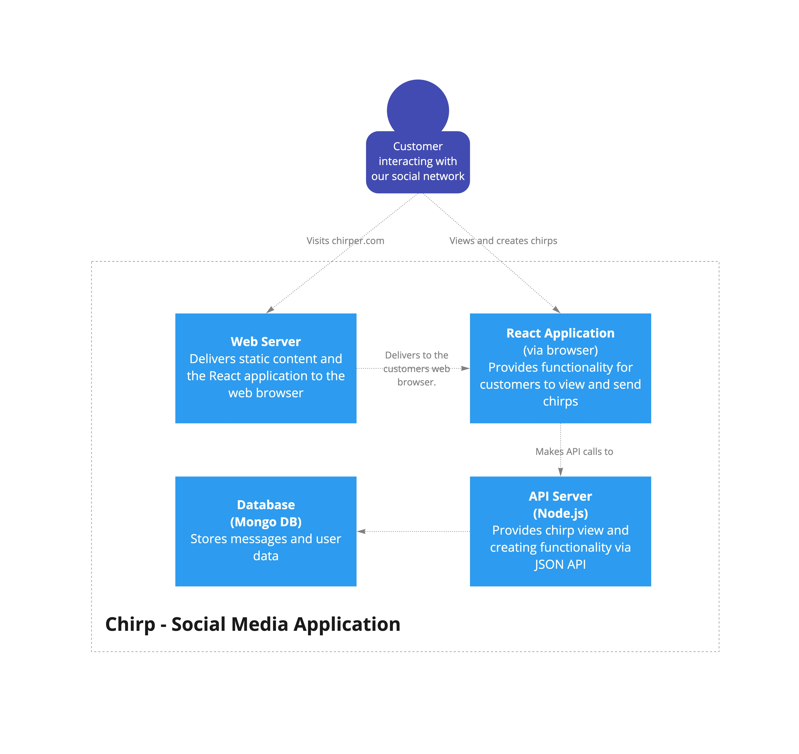

# 02 22T2 - Shared group exercise

As an accountability group, you will be working in this repository to build an API and front-end for a social media app "Chirpie". You can use it as a reference throughout the term.

## Getting started

1. Open this project in your VS Code by cloning the repository

### Server

This is where your server API code lives

2. Open your terminal, go to the `server` folder, `cd server` and install your Node dependencies: `npm install`

3. Start the server: `npm start`
### Client

This is where your front-end code lives

4. Open your terminal, go to the `client` folder, `cd client` and install your Node dependencies: `npm install`
5. Start the server: `npm start`

# Architecture



# Team Agreement

## Agreement 1 - When the meeting takes place

Meeting time will be agreed on one day prior.

## Agreement 2 - when and how long the meeting will take place

Meeting will be kept to a 2 hour maximum.

## Agreement 3 - Sharing the work

Members will take turns facilliating.

## Agreement 4 - Meeting absence

Communicate absence with the group as soon as possible via slack.

## Agreement 5 - Problem solving

Help with problem solving by talking through the issue, or guiding in the right direction. All members voices are heard!

## Agreement 6 - Communication

Open communication and keep comments constructive/positive.

# Rest API

## Request a single Chirp

### Request Details

| Endpoint | /chirps/1 |
| -------- | --------- |
| Method   | GET       |

### Response details

| Response code | 200 |
| ------------- | --- |
| Example body  |

````
{
"id": 1,
"username": "John",
"userimg": "https://stripe.com/img1",
"date": "28042022",
"time": "23:28:56",
"message": "" ,
"comments": 24,
"likes": 1300,
"rechirps": 420,
"share": "www.chirpie.com/chirps/1",
}

```|
````

## Retrieve all Chirps

### Request Details

| Endpoint | /chirps |
| -------- | ------- |
| Method   | GET     |

### Response details

| Response code | 200 |
| ------------- | --- |
| Example body  |

````
{
"id": 1,
"username": "John",
"userimg": "https://stripe.com/img1",
"date": "28042022",
"time": "23:28:56",
"message": "" ,
"comments": 24,
"likes": 1300,
"rechirps": 420,
"share": "www.chirpie.com/chirps/1",
}

```|
````

````
{
"id": 2,
"username": "Sally",
"userimg": "https://stripe.com/img2",
"date": "28042022",
"time": "23:28:56",
"message": "" ,
"comments": 24,
"likes": 1300,
"rechirps": 420,
"share": "www.chirpie.com/chirps/1",
}

```|
````

````
{
"id": 3,
"username": "Brock",
"userimg": "https://stripe.com/img3",
"date": "28042022",
"time": "23:28:56",
"message": "" ,
"comments": 24,
"likes": 1300,
"rechirps": 420,
"share": "www.chirpie.com/chirps/1",
}

```|
````

## Create a Single Chirp

### Request Details

| Endpoint | /chirps/3 |
| -------- | --------- |
| Method   | POST      |

````
{
"message": "Hello World!" ,
}

```|
````

### Response details

| Response code | 201 |
| ------------- | --- |
| Example body  |

````
{
"id": 3,
"username": "Brock",
"userimg": "https://stripe.com/img1",
"date": "28042022",
"time": "23:28:56",
"message": "Hello World!" ,
"comments": 0,
"likes": 0,
"rechirps": 0,
"share": "www.chirpie.com/chirps/3",
}

```|
````
